 

    

CRMEB开源商城系统Java版

    
    <a href='https://gitee.com/ZhongBangKeJi/crmeb_java/members'>
        </img>
    </a>
   <a href='https://gitee.com/ZhongBangKeJi/crmeb_java/stargazers'>
        </img>
    </a>

####

[官网](https://www.crmeb.com/) |
[在线体验](https://admin.java.crmeb.net) |
[帮助文档](https://doc.crmeb.com/java/crmeb_java) |
[技术社区](https://www.crmeb.com/ask/)

[comment]: <> ([宽屏预览]&#40;https://gitee.com/ZhongBangKeJi/crmeb_java/blob/master/README.md&#41;)

    <a href="https://gitee.com/ZhongBangKeJi/crmeb_java/blob/master/README.md">宽 屏 预 览</a>

    如果对您有帮助，您可以点右上角 "Star" ❤️ 支持一下 谢谢！

---

### 📖 项目介绍：

CRMEB开源商城系统Java版，是一款基于Apache-2.0协议发布的开源电商解决方案。代码全开源无加密，可免费商用，适合各类企业及开发者快速构建多端一体化商城。

---

### 💡 技术架构：

系统采用Java + Vue + uni-app技术栈，基于SpringBoot框架构建，前后端分离架构设计清晰。借助uni-app的跨端能力，轻松实现小程序、公众号、H5、APP、PC端全覆盖，数据统一、业务同步，极大提升开发与维护效率。同时，系统代码规范清晰，注释详尽，二次开发十分方便。

---

### 💡 核心功能：

**管理功能全面** 
系统核心管理功能完善，包含商品管理（支持SKU、属性、分类、评价）、订单管理、用户管理、购物车、物流管理、财务统计、多种支付方式等。

**丰富的营销工具** 
10余种营销功能能充分满足日常需求，包括拼团、砍价、秒杀、优惠券、签到、积分、等级会员、余额充值、分销裂变、活动边框、氛围图等，可灵活设置活动规则。

**可视化页面DIY装修** 
系统支持页面DIY设计，内置21种组件可自由拖拽设置，无需编码即可快速搭建个性化页面。
图片热区：在一张图片中，为不同位置添加不同的跳转链接。
图片魔方：一个组件，6种布局样式可选，能灵活满足使用需求。
导航跳转：不仅能跳转商城内部页面，也能根据具体的运营环境跳转小程序、H5等。
每种组件都有多种样式可选，组件细节支持自由调整。

---

### 💡 社区共建计划：
**社区共建计划**

我们致力于打造开发者友好生态，开放源码、持续更新功能模块，并欢迎开发者提交优化建议或贡献代码。通过共享技术成果，降低行业重复造轮子成本，推动开源电商系统的可持续发展。

🔗 <a href="https://doc.crmeb.com/single_open/open_v54/19855" target="_blank">功能列表</a> | 📩 <a href="https://gitee.com/ZhongBangKeJi/CRMEB/issues" target="_blank">提交反馈</a> | 📩 <a href="https://gitee.com/ZhongBangKeJi/CRMEB/pulls" target="_blank">提交代码</a>

---

### 💻 系统优势：
**成熟稳定的架构**  
后端：SpringBoot + SpringSecurity，前端：Vue + ElementUI（PC管理端）与uni-app（移动端），多端并行开发，结构清晰。

**规范的接口设计**  
提供规范的RESTful API与数据结构，接口复用率高，逻辑层次清晰，便于二次开发与系统集成。

**数据与统计**  
集成ECharts实现多维数据看板，支持订单、用户、资金等多维度统计分析，数据可导出，助力运营决策。
高效开发支持
支持Vue表单拖拽生成，大幅减少前端重复工作，提升开发效率。

**精细权限控制**  
基于Spring Security实现角色权限控制，可精确到按钮级别，保障系统安全。

**高可用设计**  
内置Redis队列，有效削峰解耦，提升系统并发能力与稳定性。

---

### 🔧 技术特点：
>1.SpringBoot 框架开发业界主流。   
>2.【前端】Web PC 管理端 Vue + Element UI。 
>3.【前端】移动端使用 Uni-app 框架，前后端分离开发。 
>4.标准RESTful 接口、标准数据传输，逻辑层次更明确，更多的提高api复用。 
>5.支持Redis队列，降低流量高峰，解除耦合，高可用。 
>6.数据导出，方便个性化分析。 
>7.数据统计分析,使用ECharts图表统计，实现用户、产品、订单、资金等统计分析。 
>8.Spring Security 权限管理，后台多种角色，多重身份权限管理，权限可以控制到按钮级别的操作。 
>9.Vue表单生成控件，拖拽配置表单，减少前端重复表单工作量，提高前端开发效率。 

---

### 🔧 运行环境及框架：
~~~
1.	移动端uniapp开发框架 可生成H5 公众号 微信小程序
2.	WEB Pc 管理后台使用Vue + Element UI 开发 兼容主流浏览器 ie11+
3.	后台服务 Java SpringBoot + Mybatis-plus + Mysql + redis
4.	运行环境 linux和windows等都支持,只要有Java环境和对应的数据库 redis
5.	运行条件 Java 1.8 Mysql5.7
~~~
---

### 🔧 Java项目框架 和 WEB PC 项目运行环境
~~~
1. SpringBoot 2.2.6.RELEASE
2. Maven 3.6.1
3. swagger-bootstrap-ui 1.0
4. Mybatis Plus 3.3.1
5. npm 6
6. node 14
7. vue 2.x
8. element ui 2.13
~~~

---

### 🧭 项目代码包介绍
~~~
1. admin     WEB程序         PC端管理端 VUE + ElementUi
2. app       移动商城         UniApp标准开发(H5 + 微信小程序)
3. crmeb     Api            Java SpringBoot + mybatisPlus
4. 接口文档   Api对应的接口文档也可以部署项目后查看
~~~

<!-- 移动端 uniapp 开发 使用 HbuilderX 开发

---

 -->

### 🎬 系统演示：

管理后台：https://admin.java.crmeb.net 
账号：demo 
密码：crmeb.com 

H5端：https://java.crmeb.net 

<!-- 自己搭建演示账号
移动端 18292417675 / Crmeb_123456
管理端 admin / 123456

[想了解CRMEB开源商城系统Java版整体框架，你可以戳这里快速掌握！](https://doc.crmeb.com/java/crmeb_java/2049)

--- -->

### 📃 项目资料
<!-- 需要系统文档的朋友看过来，安装文档、产品介绍、技术文档...你想要的我都有！
[https://doc.crmeb.com/java/crmeb_java](https://doc.crmeb.com/java/crmeb_java)

要安装系统，跟着视频更顺畅！CRMEB开源商城系统Java版安装视频，给你奉上！
视频教程 B站视频教程 持续更新中 [点击观看 💻🖥️](https://www.bilibili.com/video/BV1bP4y1n76P/?vd_source=40854aeda5bba4b8766afd5a99623b16) -->

**资料支持** 
使用文档：https://doc.crmeb.com/java/crmeb_java/1868 
接口文档：admin(管理端): https://api.java.crmeb.net/doc.html 
接口文档：front(商城端): https://apif.java.crmeb.net/doc.html 
数据字典：https://doc.crmeb.com/java/crmeb_java/5410 
二开文档：https://doc.crmeb.com/java/crmeb_java_23/25107 
技术社区：https://www.crmeb.com/ask/thread/list/152 

**安装教程** 
快速安装视频教程：[点击查看](https://www.bilibili.com/video/BV1bP4y1n76P/?vd_source=40854aeda5bba4b8766afd5a99623b16) 
安装步骤详解：https://doc.crmeb.com/java/crmeb_java/2154 

---

### 📲 CRMEB开源技术交流
欢迎加入CRMEB开源技术交流群，扫码进群免费领取接口文档、功能清单、UI设计图、思维导图等资源！ 
 
您还可以在 [CRMEB技术社区](https://www.crmeb.com/ask/thread/list/152) 中提交Bug、交流解决方案、获取官方更新动态，CRMEB技术社区伴您一路前行。 

<!-- ### 💟 UI界面 -->
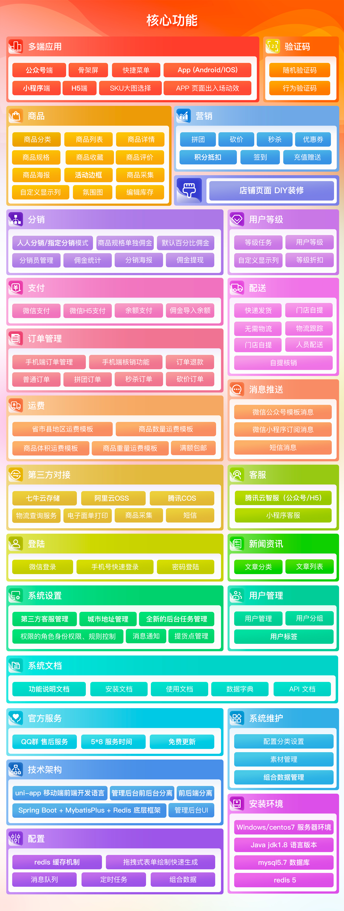
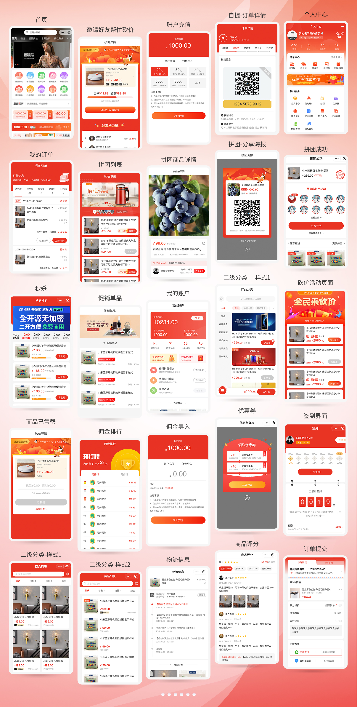
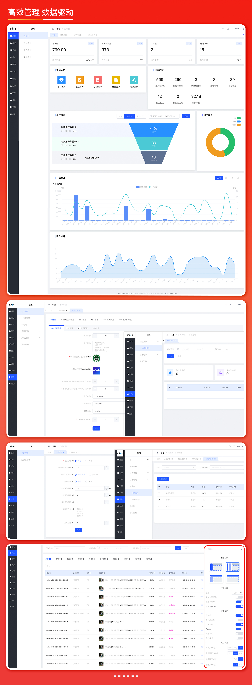

<!-- ### 📱 移动端预览 -->
<!-- 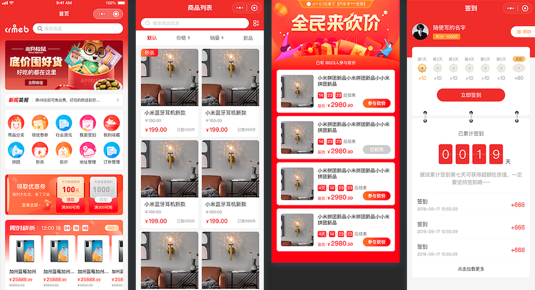
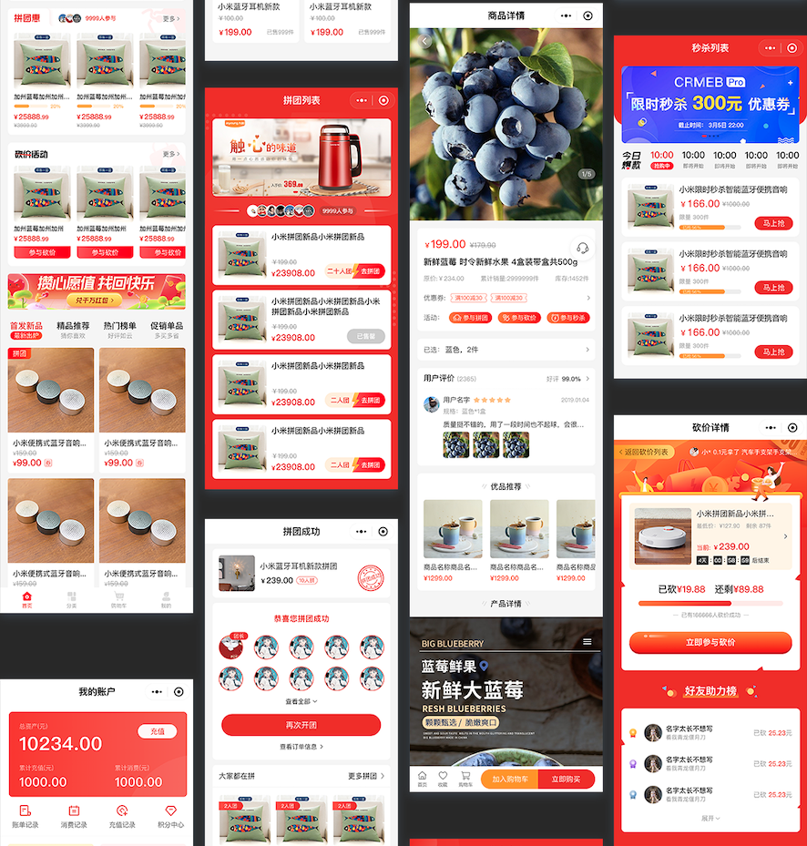
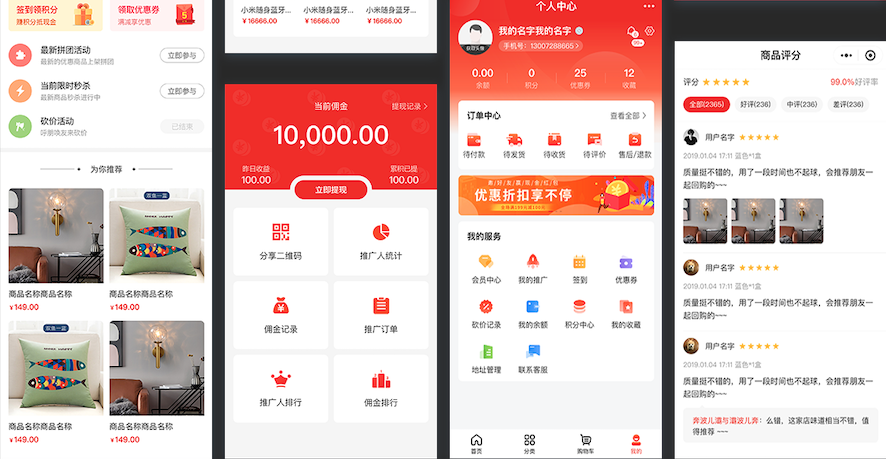 -->
<!-- 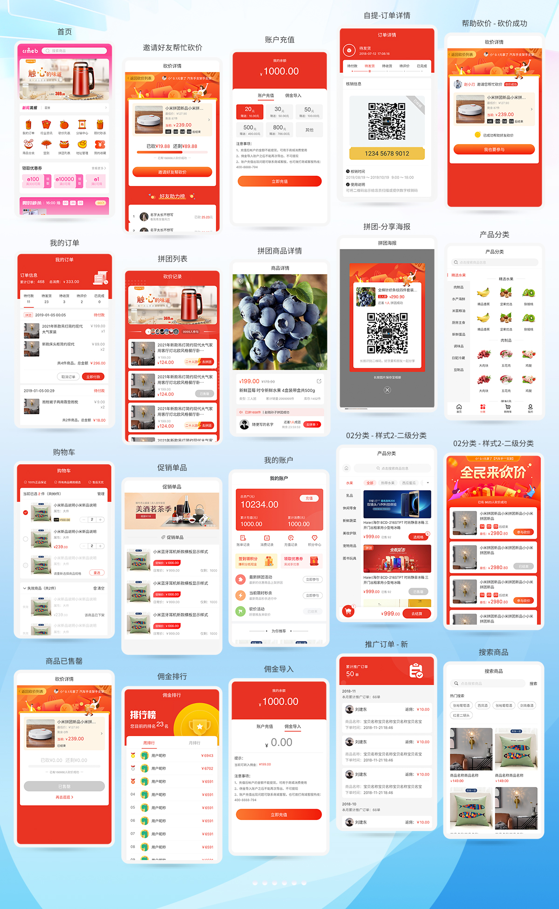 -->

<!-- ### WEB PC管理端预览 -->
<!-- 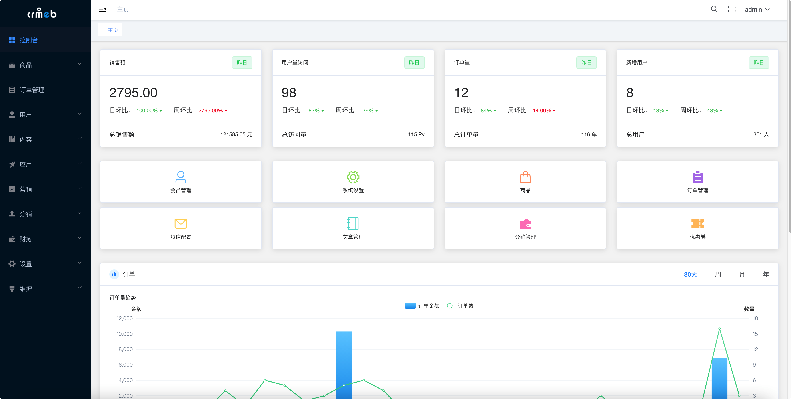
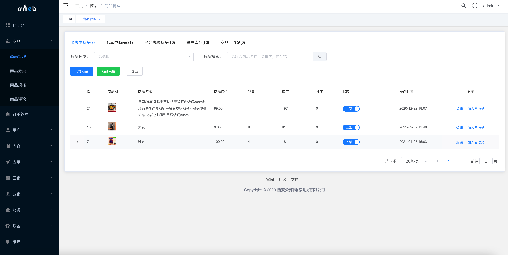
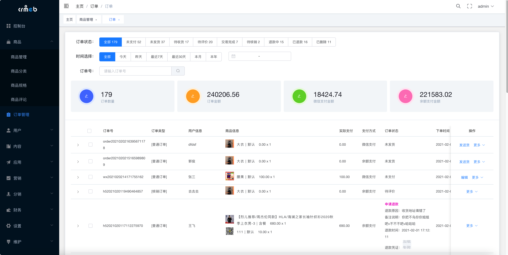
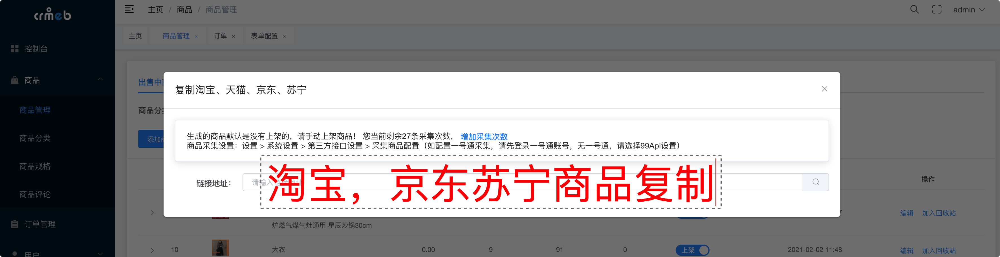
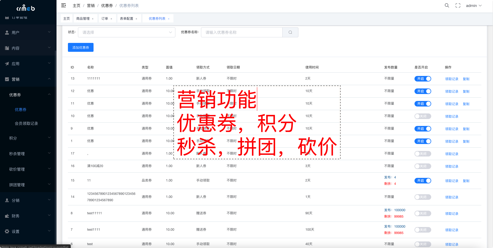
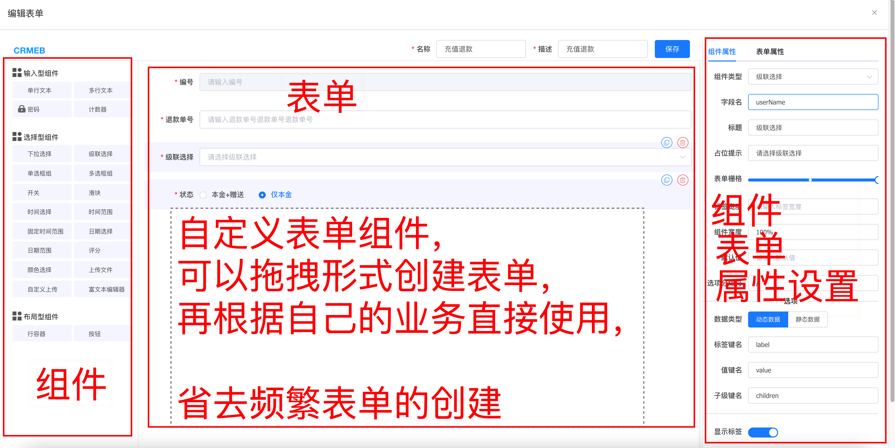 -->
<!-- 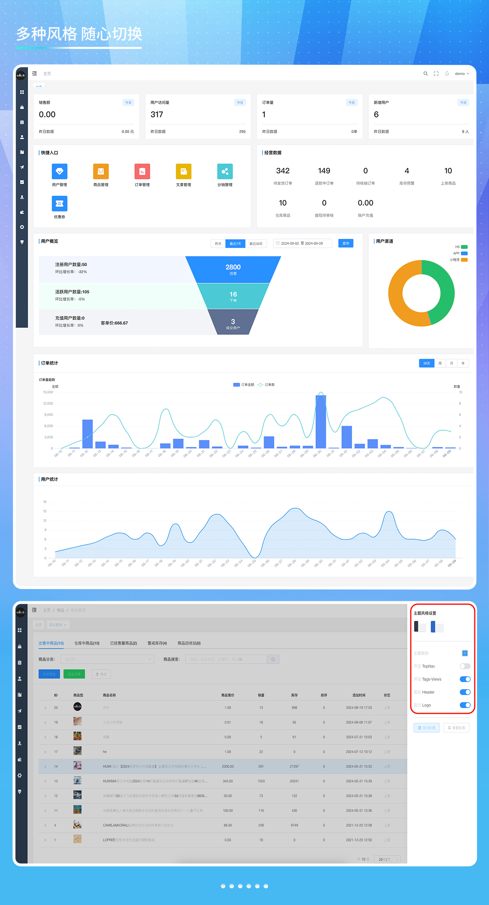

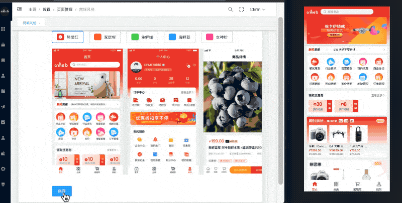
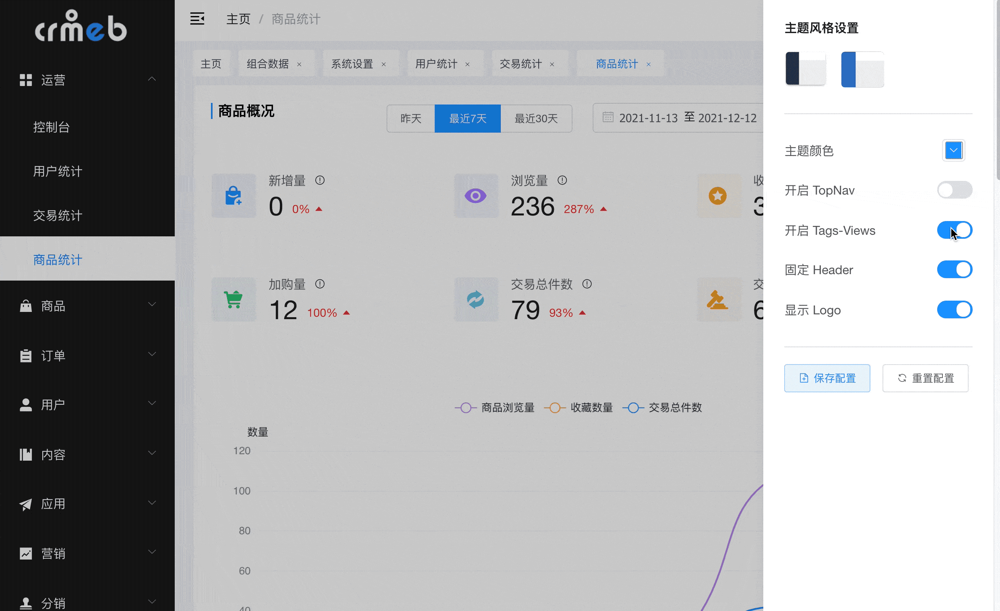 -->

---

<!-- #### 📞 技术交流
跟着官方，不迷路！欢迎扫码加入CRMEB 开源项目群，一手消息及资源，尽在掌握！ 
CRMEB JAVA 技术交流QQ群 1群 🈵️ 
CRMEB JAVA 技术交流QQ群 2群 🈵️ 
CRMEB JAVA 技术交流QQ群 3群 640230510 🈵️ 群已满  -->
<!-- [CRMEB开源商城系统开发QQ频道已开启，点击加入一起交流学习](https://pd.qq.com/s/1v2yb4e0p) 
 -->
<!-- 使用中遇到bug 或者问题可以在gitee 上提 Issues -->

<!-- ---

### 💌 特别鸣谢
核心开发团队

产品: 木子刀客

技术: ❄指缝de阳光, 怪兽的猫, 乡关何处

团队打杂: 大粽子

UI: 被子横盖显得高🐰

测试: 请叫我绵绵🐏, 夏天

--- -->

### 🔔 使用须知
1.允许用于个人学习、毕业设计、教学案例、公益事业、商业使用; 
2.如果商用必须保留版权信息，请自觉遵守; 
3.禁止将本项目的代码和资源进行任何形式的出售，产生的一切任何后果责任由侵权者自负。 

---
### 🪪 版权信息
本项目包含的第三方源码和二进制文件之版权信息另行标注。 
版权所有Copyright © 2017-2024 by CRMEB (https://www.crmeb.com) 
All rights reserved。 
CRMEB® 商标和著作权所有者为西安众邦网络科技有限公司。 

---